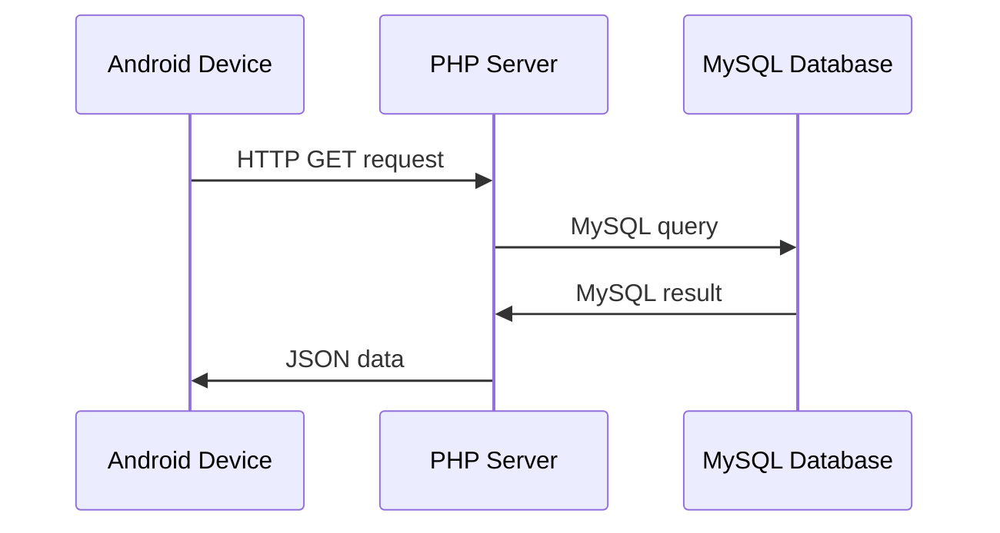

<h1>Documentation of Nice Places</h1>

<h2>Index</h2>

- [1. Overall architecture](#1-overall-architecture)
- [2. Android app](#2-android-app)
  - [2.1. Packages and classes](#21-packages-and-classes)
    - [2.1.1. Activities](#211-activities)
    - [2.1.2. Adapters](#212-adapters)
    - [2.1.3. Controllers](#213-controllers)
    - [2.1.4. DAO](#214-dao)
    - [2.1.5. Dialogs](#215-dialogs)
    - [2.1.6. Models](#216-models)
    - [2.1.7. Utils](#217-utils)
- [3. Backend API](#3-backend-api)
  - [3.1. Regions](#31-regions)
    - [3.1.1. Get all regions](#311-get-all-regions)
  - [3.2. Areas](#32-areas)
    - [3.2.1. Get all areas](#321-get-all-areas)
    - [3.2.2. Get all areas in a region](#322-get-all-areas-in-a-region)
  - [3.3. Places](#33-places)
    - [3.3.1. Get place by ID](#331-get-place-by-id)
    - [3.3.2. Get all places in an area](#332-get-all-places-in-an-area)
  - [3.4. Place of the day](#34-place-of-the-day)
- [4. Database](#4-database)

## 1. Overall architecture



The overall architecture of Nice Places is composed of three entities:

- the Android device with Nice Places app installed (the client);
- the server that runs PHP scripts;
- the MySQL database.

Based on the activities shown to the user, the client perform a HTTP GET request to the server, and the server queries the database to get the data. The, the data retrieved from the database are formatted in JSON format and forwarded to the client as response to the HTTP request.

## 2. Android app

### 2.1. Packages and classes

#### 2.1.1. Activities

The package [`com.niceplaces.niceplaces.activities`](https://github.com/niceplaces/android-app/tree/main/app/src/main/java/com/niceplaces/niceplaces/activities) contains all the classes that implement the activities of the app.

All these classes extend the class `androidx.appcompat.app.AppCompatActivity`.

- [AreaIntroActivity](https://github.com/niceplaces/android-app/blob/main/app/src/main/java/com/niceplaces/niceplaces/activities/AreaIntroActivity.kt)
- [AreaListActivity](https://github.com/niceplaces/android-app/blob/main/app/src/main/java/com/niceplaces/niceplaces/activities/AreaListActivity.kt)
- [DebugOptionsActivity](https://github.com/niceplaces/android-app/blob/main/app/src/main/java/com/niceplaces/niceplaces/activities/DebugOptionsActivity.kt)
- [ExploreActivity](https://github.com/niceplaces/android-app/blob/main/app/src/main/java/com/niceplaces/niceplaces/activities/ExploreActivity.kt)
- [InfoActivity](https://github.com/niceplaces/android-app/blob/main/app/src/main/java/com/niceplaces/niceplaces/activities/InfoActivity.kt)
- [IntroActivity](https://github.com/niceplaces/android-app/blob/main/app/src/main/java/com/niceplaces/niceplaces/activities/IntroActivity.kt)
- [LatestPlacesActivity](https://github.com/niceplaces/android-app/blob/main/app/src/main/java/com/niceplaces/niceplaces/activities/LatestPlacesActivity.kt)
- [MapsActivity](https://github.com/niceplaces/android-app/blob/main/app/src/main/java/com/niceplaces/niceplaces/activities/MapsActivity.kt)
- [MenuActivity](https://github.com/niceplaces/android-app/blob/main/app/src/main/java/com/niceplaces/niceplaces/activities/MenuActivity.kt)
- [NotificationsActivity](https://github.com/niceplaces/android-app/blob/main/app/src/main/java/com/niceplaces/niceplaces/activities/NotificationsActivity.kt)
- [PlacesDetailsActivity](https://github.com/niceplaces/android-app/blob/main/app/src/main/java/com/niceplaces/niceplaces/activities/PlaceDetailsActivity.kt)
- [PlacesListActivity](https://github.com/niceplaces/android-app/blob/main/app/src/main/java/com/niceplaces/niceplaces/activities/PlacesListActivity.kt)
- [PrivacyActivity](https://github.com/niceplaces/android-app/blob/main/app/src/main/java/com/niceplaces/niceplaces/activities/PrivacyActivity.kt)
- [SettingsActivity](https://github.com/niceplaces/android-app/blob/main/app/src/main/java/com/niceplaces/niceplaces/activities/SettingsActivity.kt)
- [SplashActivity](https://github.com/niceplaces/android-app/blob/main/app/src/main/java/com/niceplaces/niceplaces/activities/SplashActivity.kt)
- [UsersListActivity](https://github.com/niceplaces/android-app/blob/main/app/src/main/java/com/niceplaces/niceplaces/activities/UserListActivity.kt)

#### 2.1.2. Adapters

The package [`com.niceplaces.niceplaces.adapters`](https://github.com/niceplaces/android-app/tree/main/app/src/main/java/com/niceplaces/niceplaces/adapters) contains all the classes that implement the adapters to render the listviews in the app.

- [AreasAdapter](https://github.com/niceplaces/android-app/blob/main/app/src/main/java/com/niceplaces/niceplaces/adapters/AreasAdapter.kt)
- [EventsAdapter](https://github.com/niceplaces/android-app/blob/main/app/src/main/java/com/niceplaces/niceplaces/adapters/EventsAdapter.kt)
- [ExplorePlacesAdapter](https://github.com/niceplaces/android-app/blob/main/app/src/main/java/com/niceplaces/niceplaces/adapters/ExplorePlacesAdapter.kt)
- [LatestPlacesAdapter](https://github.com/niceplaces/android-app/blob/main/app/src/main/java/com/niceplaces/niceplaces/adapters/LatestPlacesAdapter.kt)
- [ListAdapter](https://github.com/niceplaces/android-app/blob/main/app/src/main/java/com/niceplaces/niceplaces/adapters/ListsAdapter.kt)
- [MarkerInfoAdapter](https://github.com/niceplaces/android-app/blob/main/app/src/main/java/com/niceplaces/niceplaces/adapters/MarkerInfoAdapter.kt)
- [NotificationsAdapter](https://github.com/niceplaces/android-app/blob/main/app/src/main/java/com/niceplaces/niceplaces/adapters/NotificationsAdapter.kt)
- [PlacesAdapter](https://github.com/niceplaces/android-app/blob/main/app/src/main/java/com/niceplaces/niceplaces/adapters/PlacesAdapter.kt)
- [RegionsAdapter](https://github.com/niceplaces/android-app/blob/main/app/src/main/java/com/niceplaces/niceplaces/adapters/RegionsAdapter.kt)
- [ViewPagerAdapter](https://github.com/niceplaces/android-app/blob/main/app/src/main/java/com/niceplaces/niceplaces/adapters/ViewPagerAdapter.kt)

#### 2.1.3. Controllers

The package `com.niceplaces.niceplaces.controllers`

#### 2.1.4. DAO

The package [`com.niceplaces.niceplaces.dao`](https://github.com/niceplaces/android-app/blob/main/app/src/main/java/com/niceplaces/niceplaces/dao) contains all the classes that implements the Database Access Object to retrieve data from the server.

- [DaoAreas](https://github.com/niceplaces/android-app/blob/main/app/src/main/java/com/niceplaces/niceplaces/dao/DaoAreas.kt)
- [DaoLists](https://github.com/niceplaces/android-app/blob/main/app/src/main/java/com/niceplaces/niceplaces/dao/DaoLists.kt)
- [DaoPlaces](https://github.com/niceplaces/android-app/blob/main/app/src/main/java/com/niceplaces/niceplaces/dao/DaoPlaces.kt)
- [DaoRegions](https://github.com/niceplaces/android-app/blob/main/app/src/main/java/com/niceplaces/niceplaces/dao/DaoRegions.kt)

#### 2.1.5. Dialogs

The package [`com.niceplaces.niceplaces.dialogs`](https://github.com/niceplaces/android-app/tree/main/app/src/main/java/com/niceplaces/niceplaces/dialogs) contains the classes that implements dialogs visible in the app.

- [RateDialog](https://github.com/niceplaces/android-app/blob/main/app/src/main/java/com/niceplaces/niceplaces/dialogs/RateDialog.kt)

#### 2.1.6. Models

The package [`com.niceplaces.niceplaces.models`](https://github.com/niceplaces/android-app/tree/main/app/src/main/java/com/niceplaces/niceplaces/models) contains all the classes that models entities that are part of the app.

- [Area](https://github.com/niceplaces/android-app/blob/main/app/src/main/java/com/niceplaces/niceplaces/models/Area.kt)
- [Event](https://github.com/niceplaces/android-app/blob/main/app/src/main/java/com/niceplaces/niceplaces/models/Event.kt)
- [GeoPoint](https://github.com/niceplaces/android-app/blob/main/app/src/main/java/com/niceplaces/niceplaces/models/GeoPoint.kt)
- [MyClusterItem](https://github.com/niceplaces/android-app/blob/main/app/src/main/java/com/niceplaces/niceplaces/models/MyClusterItem.kt)
- [Notification](https://github.com/niceplaces/android-app/blob/main/app/src/main/java/com/niceplaces/niceplaces/models/Notification.kt)
- [Place](https://github.com/niceplaces/android-app/blob/main/app/src/main/java/com/niceplaces/niceplaces/models/Place.kt)
- [PlacesList](https://github.com/niceplaces/android-app/blob/main/app/src/main/java/com/niceplaces/niceplaces/models/PlacesList.kt)
- [Region](https://github.com/niceplaces/android-app/blob/main/app/src/main/java/com/niceplaces/niceplaces/models/Region.kt)

#### 2.1.7. Utils

The package [`com.niceplaces.niceplaces.utils`](https://github.com/niceplaces/android-app/tree/main/app/src/main/java/com/niceplaces/niceplaces/utils) contains classes of general utilities.

- [AppRater](https://github.com/niceplaces/android-app/blob/main/app/src/main/java/com/niceplaces/niceplaces/utils/AppRater.kt)
- [AppUtils](https://github.com/niceplaces/android-app/blob/main/app/src/main/java/com/niceplaces/niceplaces/utils/AppUtils.kt)
- [ImageUtils](https://github.com/niceplaces/android-app/blob/main/app/src/main/java/com/niceplaces/niceplaces/utils/ImageUtils.kt)
- [JSONUtils](https://github.com/niceplaces/android-app/blob/main/app/src/main/java/com/niceplaces/niceplaces/utils/JSONUtils.kt)
- [MapUtils](https://github.com/niceplaces/android-app/blob/main/app/src/main/java/com/niceplaces/niceplaces/utils/MapUtils.kt)
- [MyRenderer](https://github.com/niceplaces/android-app/blob/main/app/src/main/java/com/niceplaces/niceplaces/utils/MyRenderer.kt)
- [MyRunnable](https://github.com/niceplaces/android-app/blob/main/app/src/main/java/com/niceplaces/niceplaces/utils/MyRunnable.kt)
- [NonHierarchicalDistanceBasedAlgorithm](https://github.com/niceplaces/android-app/blob/main/app/src/main/java/com/niceplaces/niceplaces/utils/NonHierarchicalDistanceBasedAlgorithm.kt)
- [NonScrollListView](https://github.com/niceplaces/android-app/blob/main/app/src/main/java/com/niceplaces/niceplaces/utils/NonScrollListView.kt)
- [RepeatListener](https://github.com/niceplaces/android-app/blob/main/app/src/main/java/com/niceplaces/niceplaces/utils/RepeatListener.kt)
- [StringUtils](https://github.com/niceplaces/android-app/blob/main/app/src/main/java/com/niceplaces/niceplaces/utils/StringUtils.kt)
- [TextUtils](https://github.com/niceplaces/android-app/blob/main/app/src/main/java/com/niceplaces/niceplaces/utils/TextUtils.kt)

## 3. Backend API

### 3.1. Regions

#### 3.1.1. Get all regions

HTTP request:

[`GET /data/v3/release/regions`](https://www.niceplaces.it/data/v3/release/regions)

JSON response:

```
[
  {
    "id": string,
    "id_string": string,
    "id_string_en": string,
    "name": string,
    "name_en": string,
    "count": string
  },
  ...
]
```

### 3.2. Areas

#### 3.2.1. Get all areas

HTTP request:

[`GET /data/v3/release/areas`](https://www.niceplaces.it/data/v3/release/areas)

JSON response:

```
[
  {
    "id": string,
    "id_string": string,
    "name": string,
    "name_en": string,
    "image": string,
    "count": string
  },
  ...
]
```

#### 3.2.2. Get all areas in a region

HTTP request:

[`GET /data/v3/release/regions/ + id_region`](https://www.niceplaces.it/data/v3/release/regions/1)

JSON response:

```
[
  {
    "id": string,
    "id_string": string,
    "id_string_en": string,
    "name": string,
    "name_en": string,
    "image": string,
    "count": string
  },
  ...
]
```

### 3.3. Places

#### 3.3.1. Get place by ID

HTTP request:

[`GET /data/v3/release/places/` + id_place](https://www.niceplaces.it/data/v3/release/places/1)

JSON response:

```
{
  "id": string,
  "id_string": string,
  "id_string_en": string,
  "id_area": string,
  "id_area_en": string,
  "id_region": string,
  "id_region_en": string,
  "name": string,
  "name_en": string,
  "area": string,
  "area_en": string,
  "region": string,
  "region_en": string,
  "description": string,
  "description_en": string,
  "desc_sources": string,
  "author": string,
  "latitude": string,
  "longitude": string,
  "image": string,
  "img_credits": string,
  "wiki_url": string,
  "wiki_url_en": string,
  "facebook": string,
  "instagram": string,
  "events": [
    {
      "id": string,
      "date": string,
      "description": string
    },
    ...
  ]
}
```

#### 3.3.2. Get all places in an area

HTTP request:

[`GET /data/v3/release/areas/ + id_area`](https://www.niceplaces.it/data/v3/release/areas/1)

JSON response:

```
[
  {
    "id": string,
    "name": string,
    "name_en": string,
    "image": string,
    "has_description": boolean,
    "has_description_en": boolean,
    "author": string,
    "has_image": boolean,
    "wiki_url": string,
    "wiki_url_en": string
  },
  ...
]
```

### 3.4. Place of the day

HTTP request:

[`GET /data/v3/release/placeoftheday`](https://www.niceplaces.it/data/v3/release/placeoftheday) (for Italian version)

[`GET /data/v3/release/placeoftheday-en`](https://www.niceplaces.it/data/v3/release/placeoftheday-en) (for English version)

JSON response:

```
{
  "id": string,
  "id_string": string,
  "id_string_en": string,
  "id_area": string,
  "id_area_en": string,
  "id_region": string,
  "id_region_en": string,
  "name": string,
  "name_en": string,
  "area": string,
  "area_en": string,
  "region": string,
  "region_en": string,
  "description": string,
  "description_en": string,
  "desc_sources": string,
  "author": string,
  "latitude": string,
  "longitude": string,
  "image": string,
  "img_credits": string,
  "wiki_url": string,
  "wiki_url_en": string,
  "facebook": string,
  "instagram": string,
  "events": [
    {
      "id": string,
      "date": string,
      "description": string
    },
    ...
  ]
}
```

## 4. Database
